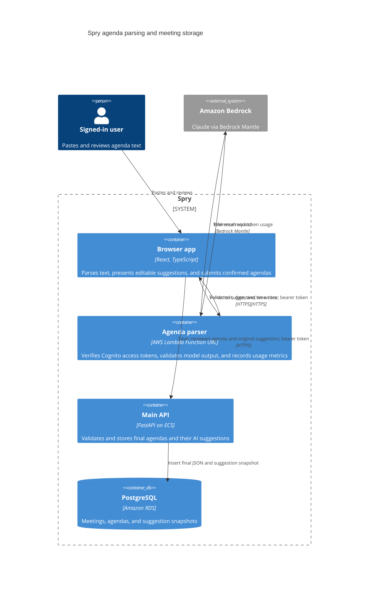

# Spry containers

```mermaid
C4Container
    title Spry agenda parsing and meeting storage
    Person(user, "Signed-in user", "Pastes and reviews agenda text")
    System_Boundary(spry, "Spry") {
        Container(browser, "Browser app", "React, TypeScript", "Parses text, presents editable suggestions, and submits confirmed agendas")
        Container(parser, "Agenda parser", "AWS Lambda Function URL", "Verifies Cognito access tokens, validates model output, and records usage metrics")
        Container(api, "Main API", "FastAPI on ECS", "Validates and stores final agendas and their AI suggestions")
        ContainerDb(db, "PostgreSQL", "Amazon RDS", "Meetings, agendas, and suggestion snapshots")
    }
    System_Ext(bedrock, "Amazon Bedrock", "Claude via Bedrock Mantle")

    Rel(user, browser, "Pastes and reviews")
    Rel(browser, parser, "Parse: text, date, and time zone; bearer token", "HTTPS")
    Rel(parser, bedrock, "Inference request", "Bedrock Mantle")
    Rel(bedrock, parser, "Tool result and token usage")
    Rel(parser, browser, "Validated suggestion; no writes", "HTTPS")
    Rel(browser, api, "Save: reviewed agenda and original suggestion; bearer token", "HTTPS")
    Rel(api, db, "Insert final JSON and suggestion snapshot")
```

The parser Lambda has no VPC configuration. Model output is a suggestion only; the authenticated main API is the only writer.
